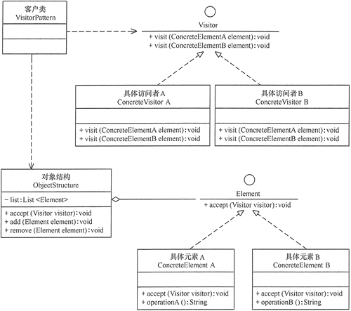

# 访问者（Visitor）模式
访问者（Visitor）模式的定义：
将**作用于某种数据结构中的各元素的操作**分离出来封装成独立的类，
使其在不改变数据结构的前提下可以添加作用于这些元素的新的**操作**，
为数据结构中的每个元素提供多种访问方式。

它将对数据的操作与数据结构进行分离，是行为类模式中最复杂的一种模式。

类图：

访问者（Visitor）模式是一种对象行为型模式，其主要优点如下。
1. 扩展性好。能够在不修改对象结构中的元素的情况下，为对象结构中的元素添加新的功能。
2. 复用性好。可以通过访问者来定义整个对象结构通用的功能，从而提高系统的复用程度。
3. 灵活性好。访问者模式将数据结构与作用于结构上的操作解耦，使得操作集合可相对自由地演化而不影响系统的数据结构。
4. 符合单一职责原则。访问者模式把相关的行为封装在一起，构成一个访问者，使每一个访问者的功能都比较单一。

访问者（Visitor）模式的主要缺点如下。
1. 增加新的元素类很困难。在访问者模式中，每增加一个新的元素类，都要在每一个具体访问者类中增加相应的具体操作，这违背了“开闭原则”。
2. 破坏封装。访问者模式中具体元素对访问者公布细节，这破坏了对象的封装性。
3. 违反了依赖倒置原则。访问者模式依赖了具体类，而没有依赖抽象类。

访问者（Visitor）模式是使用频率较高的一种设计模式，它常常同以下两种设计模式联用。

1. 与“迭代器模式”联用。因为访问者模式中的“对象结构”是一个包含元素角色的容器，
    当访问者遍历容器中的所有元素时，常常要用迭代器。如【例1】中的对象结构是用 List 实现的，它通过 List 对象的 Iterator() 方法获取迭代器。
    如果对象结构中的聚合类没有提供迭代器，也可以用迭代器模式自定义一个。
2. 访问者（Visitor）模式同“组合模式”联用。
    因为访问者（Visitor）模式中的“元素对象”可能是叶子对象或者是容器对象，如果元素对象包含容器对象，就必须用到组合模式，
    
    