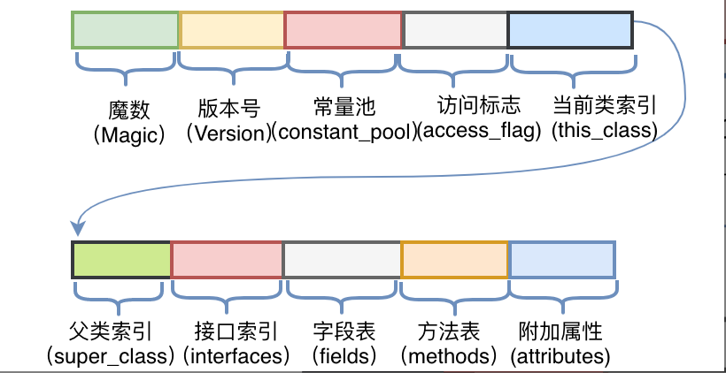
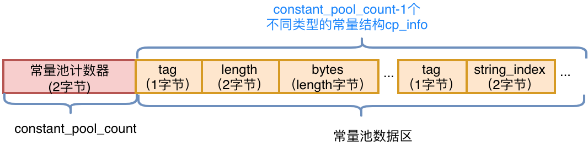
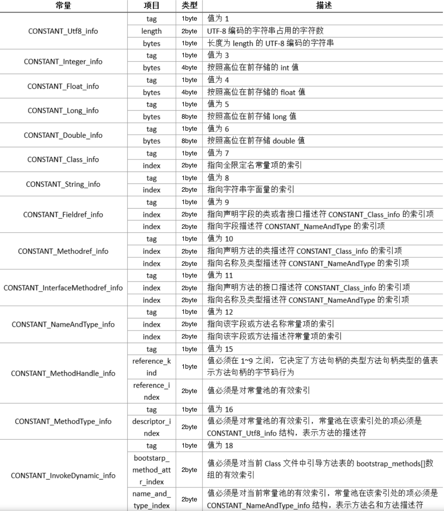
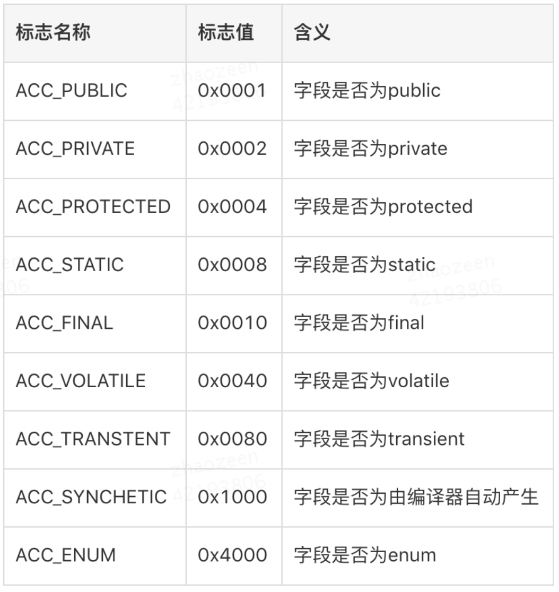
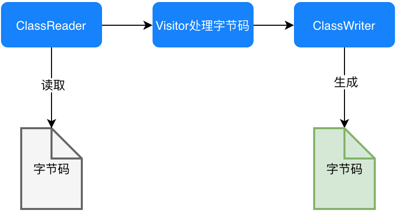

# 美团：字节码增强技术探索  
  https://tech.meituan.com/2019/09/05/java-bytecode-enhancement.html

JVM对于字节码是有规范要求的，那么看似杂乱的十六进制符合什么结构呢？  
JVM规范要求每一个字节码文件都要由十部分按照固定的顺序组成，整体结构如图 所示：

## 1. 各部分简介

1. 魔数（Magic Number）  
    所有的.class文件的前四个字节都是魔数，魔数的固定值为：0xCAFEBABE。
    魔数放在文件开头，JVM可以根据文件的开头来判断这个文件是否可能是一个.class文件，
    如果是，才会继续进行之后的操作。
2. 版本号  
    版本号为魔数之后的4个字节，前两个字节表示次版本号（Minor Version），后两个字节表示主版本号（Major Version）。
    如版本号为“00 00 00 34”，次版本号转化为十进制为0，主版本号转化为十进制为52，
    在Oracle官网中查询序号52对应的主版本号为1.8，所以编译该文件的Java版本号为1.8.0。
3. 常量池  
    紧接着主版本号之后的字节为常量池入口。常量池中存储两类常量：字面量与符号引用。
    字面量为代码中声明为Final的常量值，符号引用如类和接口的全局限定名、字段的名称和描述符、方法的名称和描述符。
    常量池整体上分为两部分：常量池计数器以及常量池数据区，如下图所示。

    - 常量池计数器（constant_pool_count）：  
        由于常量的数量不固定，所以需要先放置两个字节来表示常量池容量计数值  
        示例图中，将十六进制的24转化为十进制值为36，排除掉下标“0”，也就是说，这个类文件中共有35个常量
    - 常量池数据区：  
        数据区是由（constant_pool_count-1）个cp_info结构组成，一个cp_info结构对应一个常量。  
        在字节码中共有14种类型的cp_info（如下图所示），每种类型的结构都是固定的。  
        
4. 访问标志  
   常量池结束之后的两个字节，描述该Class是类还是接口，以及是否被Public、Abstract、Final等修饰符修饰。
   JVM规范规定了如下图的访问标志（Access_Flag）。
   
   需要注意的是，JVM并没有穷举所有的访问标志，而是使用按位或操作来进行描述的，
   比如某个类的修饰符为Public Final，则对应的访问修饰符的值为ACC_PUBLIC | ACC_FINAL，即0x0001 | 0x0010=0x0011。
5. 当前类名  
访问标志后的两个字节，描述的是当前类的全限定名。这两个字节保存的值为常量池中的索引值，根据索引值就能在常量池中找到这个类的全限定名。

6. 父类名称  
当前类名后的两个字节，描述父类的全限定名，同上，保存的也是常量池中的索引值。

7. 接口信息  
父类名称后为两字节的接口计数器，描述了该类或父类实现的接口数量。紧接着的n个字节是所有接口名称的字符串常量的索引值。

8. 字段表  
   
   ....
   
   

## 2. 字节码增强

### 2.1 ASM
对于需要手动操纵字节码的需求，可以使用ASM，
它可以直接生产 .class字节码文件，也可以在类被加载入JVM之前动态修改类行为（如下图17所示）。
ASM的应用场景有AOP（Cglib就是基于ASM）、热部署、修改其他jar包中的类等。

#### 2.1.1 ASM API
##### 2.1.1.1 核心API
ASM Core API可以类比解析XML文件中的SAX方式，不需要把这个类的整个结构读取进来，就可以用流式的方法来处理字节码文件。
好处是非常节约内存，但是编程难度较大。然而出于性能考虑，一般情况下编程都使用Core API。在Core API中有以下几个关键类：

- ClassReader：用于读取已经编译好的.class文件。
- ClassWriter：用于重新构建编译后的类，如修改类名、属性以及方法，也可以生成新的类的字节码文件。
- 各种Visitor类：如上所述，CoreAPI根据字节码从上到下依次处理，对于字节码文件中不同的区域有不同的Visitor，
  比如用于访问方法的MethodVisitor、用于访问类变量的FieldVisitor、用于访问注解的AnnotationVisitor等。
  为了实现AOP，重点要使用的是MethodVisitor。

##### 2.1.1.2 树形API
ASM Tree API可以类比解析XML文件中的DOM方式，把整个类的结构读取到内存中，缺点是消耗内存多，但是编程比较简单。
TreeApi不同于CoreAPI，TreeAPI通过各种Node类来映射字节码的各个区域，类比DOM节点，就可以很好地理解这种编程方式。

#### 2.1.2 直接利用ASM实现AOP

#### 2.1.3 ASM工具

### 2.2 Javassist
ASM是在指令层次上操作字节码的，阅读上文后，我们的直观感受是在指令层次上操作字节码的框架实现起来比较晦涩。
故除此之外，我们再简单介绍另外一类框架：强调源代码层次操作字节码的框架Javassist。

利用Javassist实现字节码增强时，可以无须关注字节码刻板的结构，其优点就在于编程简单。
直接使用java编码的形式，而不需要了解虚拟机指令，就能动态改变类的结构或者动态生成类。
其中最重要的是ClassPool、CtClass、CtMethod、CtField这四个类：

- CtClass（compile-time class）：  
    编译时类信息，它是一个class文件在代码中的抽象表现形式，可以通过一个类的全限定名来获取一个CtClass对象，用来表示这个类文件。
- ClassPool：
    从开发视角来看，ClassPool是一张保存CtClass信息的HashTable，key为类名，value为类名对应的CtClass对象。
    当我们需要对某个类进行修改时，就是通过pool.getCtClass(“className”)方法从pool中获取到相应的CtClass。
- CtMethod、CtField：这两个比较好理解，对应的是类中的方法和属性。

