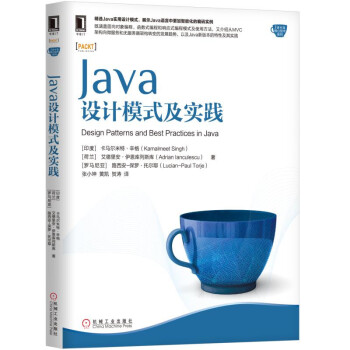

# Java设计模式及实践

## 第1章 从面向对象到函数式编程      1

## 第2章 创建型模式                18

## 第3章 行为型模式                37

## 第4章 结构型模式                60

## 第5章 函数式编程                89

## 第6章 响应式编程                112

## 第7章 响应式设计模式             140

## 第8章 应用架构的发展趋势          159

## 第9章 Java中的最佳实践           186

## 完结                           206

